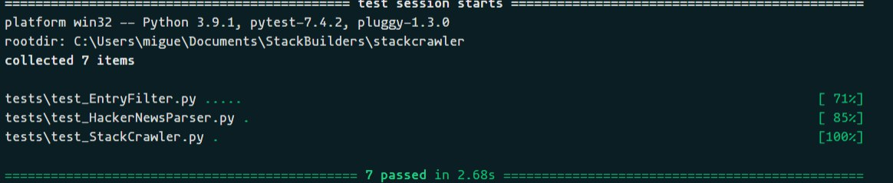

# StackCrawler

## Introduction

StackCrawler is a straightforward web crawler developed as part of a coding exercise for StackBuilder's hiring process.
My goal during development was to try to adhere as much as possible to best practices regarding OOP, TDD and DDD.

## Usage

### **Install dependencies**
This project uses [`poetry`](https://python-poetry.org/) for managing dependencies, so they can be installed running:

```Bash
$ poetry install
```

### **Activate virtual environemnt**

```Bash
$ poetry shell
```

### **Run tests**
This project uses [`pytest`](https://docs.pytest.org/en/7.4.x/) for testing. Use the following command for running tests:

```Bash
$ pytest
```



**`Note`**: Make sure you're using the right virtual environment before running this command. In poetry you can active the virtualenv using `$ poetry shell`


# What's in here?
## `Entry`

A class that represents the data we are going to use from entries, this is our main domain object.

It's a "frozen" dataclass, so we are able to use it as a consistent data container. Additionally, this will help us implement unit tests more easily.

```Python
@dataclass(frozen=True)
class Entry:
  title: str
  order_number: int
  comments_count: int
  points: int
```

### `HackerNewsEntry`
A specification of the Entry class that represents the data contained in entries from [https://news.ycombinator.com/](https://news.ycombinator.com/). This class helps us apply the dependency inversion principle, so other funcions depend on the high level Entry class and not in this specification.


## `EntryFilter`

A class that encapsulates a set of filtering / ordering methods

```Python
class EntryFilter:

    def _filter_by_words_count(
      self,
      filter_fn: callable,
      entries: List[Entry],
    ) -> List[Entry] :
      ...


    def filter_by_word_count_and_order_by_comments(self, entries: List[Entry], words_count_gt: int = 5, ascending: bool = True) -> List[Entry]:
      ...

    def filter_by_word_count_and_order_by_points(self, entries: List[Entry], words_count_le: int = 5, ascending: bool = True) -> List[Entry]:
      ...

```


## `Parser`

A generic class that defines an interface for classes that will encapsulate a set of parsing methods.

```Python
class Parser:
  
  def parse_entries_from_HTML(self, url: str, limit: int) -> List[Entry]:
    ...  
```

### `HackerNewsParser`
Similar to HackerNewsEntry, this class is a specification of Parser that encapsulates methods for parsing input from the html retrieved from [https://news.ycombinator.com/](https://news.ycombinator.com/)


## `StackCrawler`

This is the class in charge of retrieving data and implementing parsing methods through dependency injection. Besides, it holds an EntryFilter object so it can expose it's filterin/ordering functionalities.

```Python
class Parser:
  
  def __init__(self, parser: Parser, filter: EntryFilter):
    ...

  def parse_entries_from_HTML(self, url: str, limit: int) -> List[Entry]:
    ...  
```

## tests/

Unit tests for the entire package, using `pytest`

## main.py

Just a quick demo :)


